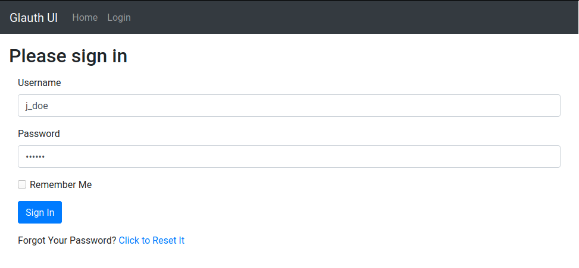
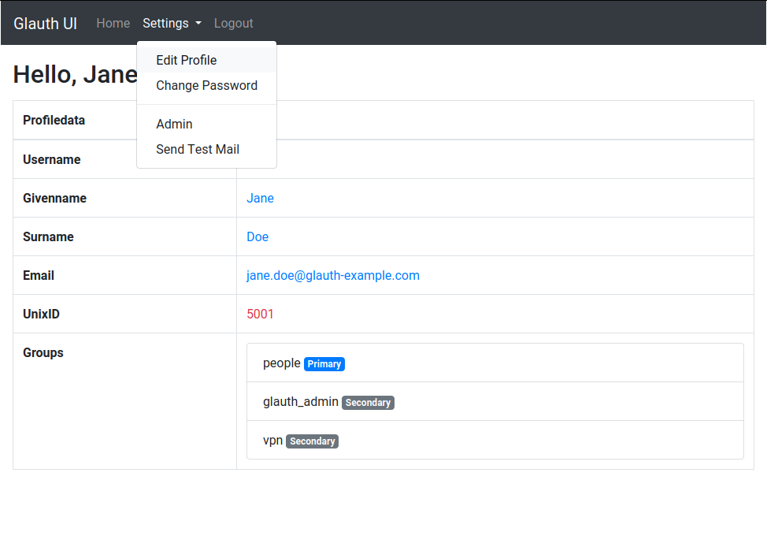
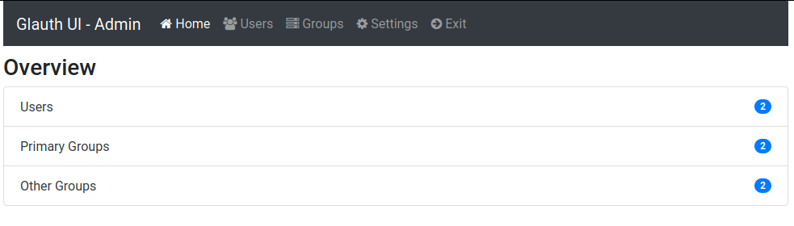
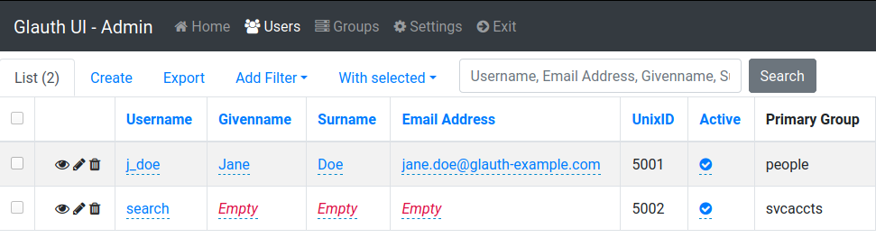
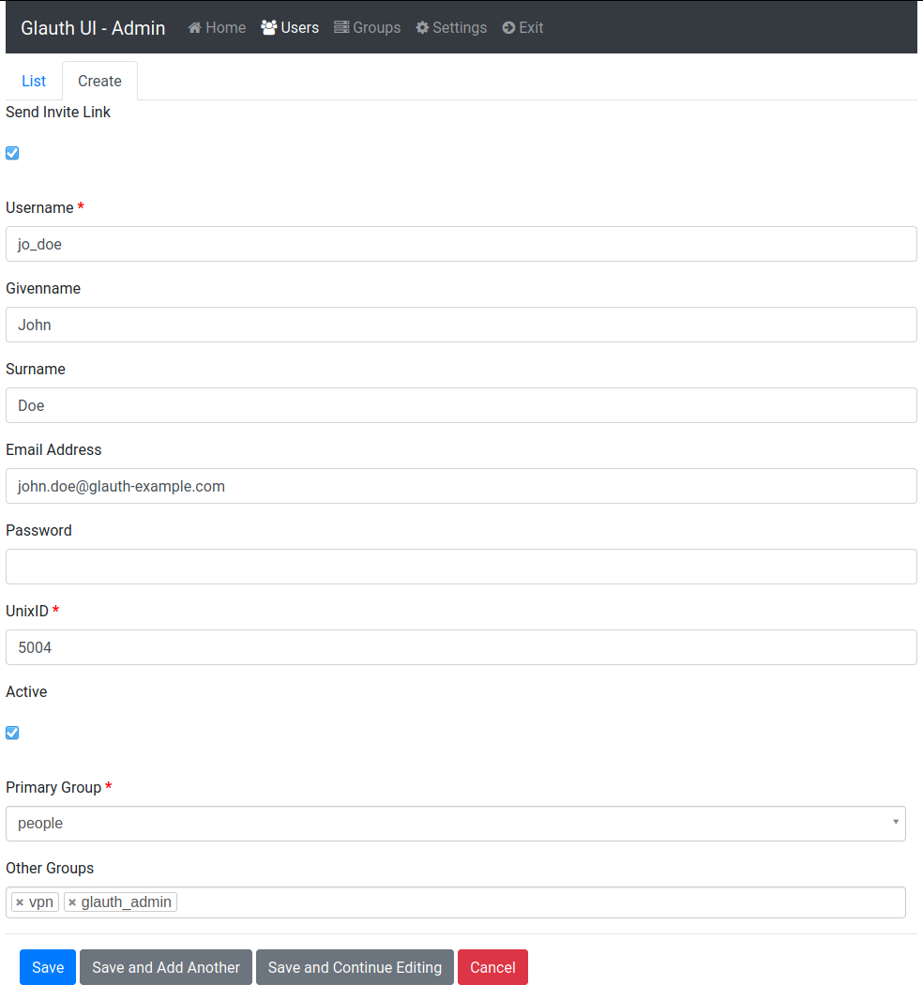
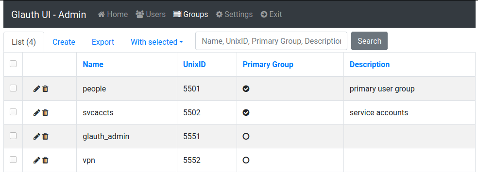
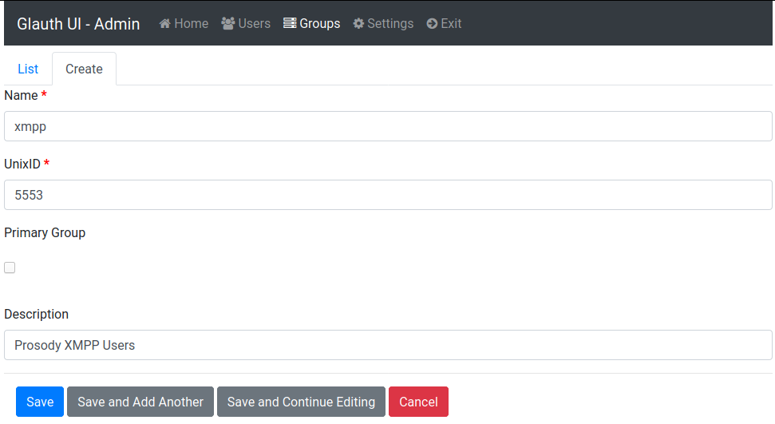
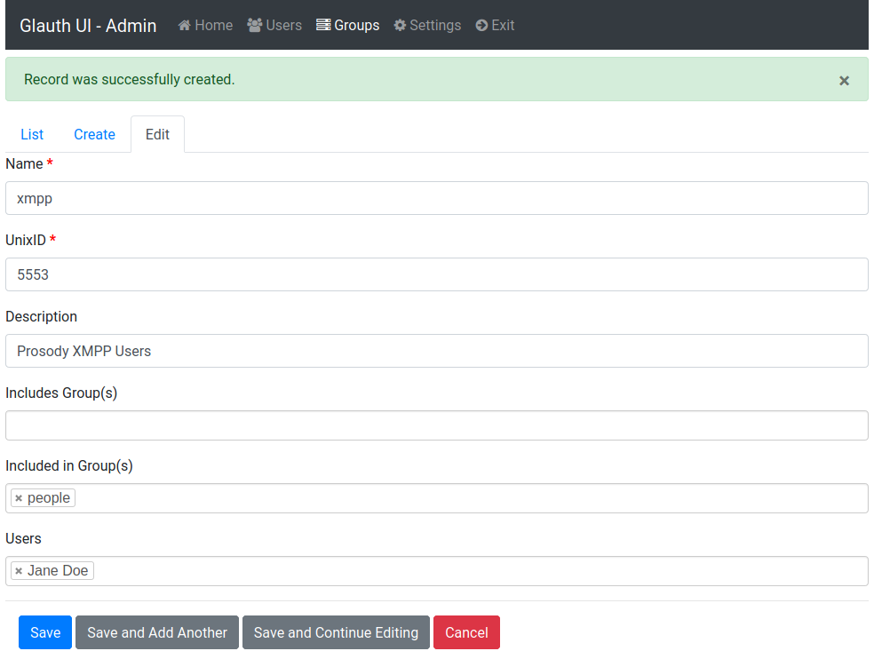
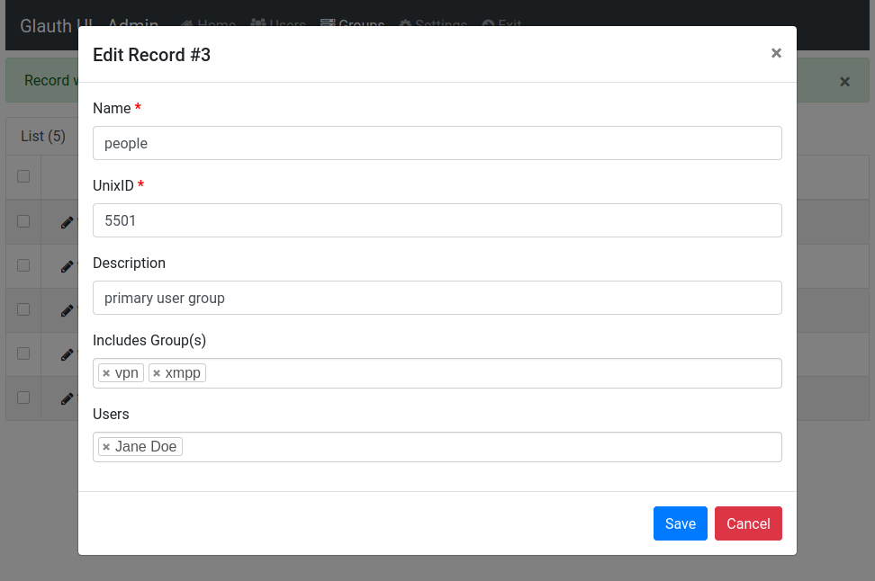
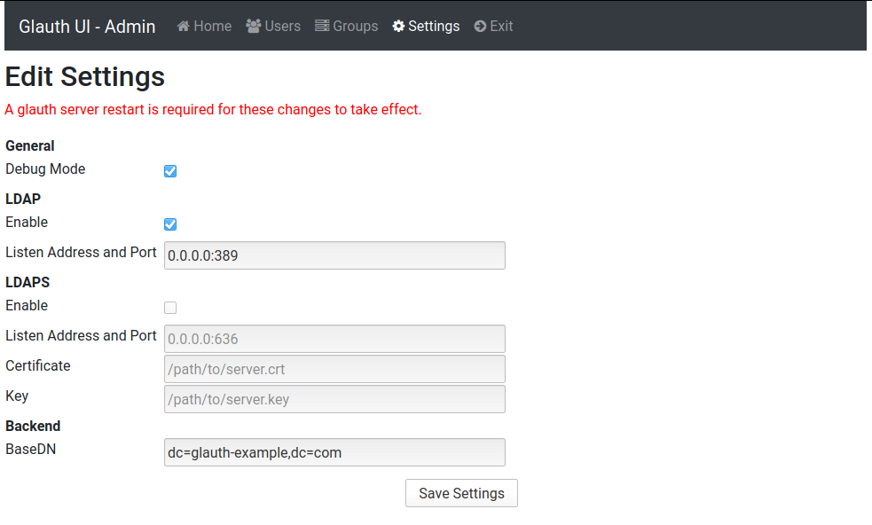

# glauth-ui

## Latest Changes: 

### 2022-01-13:
  - added support for glauth 2.x config layout

## Overview

**Glauth-UI** is a small flask web app i created to manage the minimal [glauth ldap server](https://github.com/glauth/glauth).
I created this as i wanted to use glauth for authentication in several service at home and at work, but since it is readonly there is no way for users to configure their own password for example.

Since i knew a bit of python and wanted to learn flask i thought i create a small webapp that acts as a management ui for glauth. 

This should be considered as a prove of concept and some glauth features arent implemented yet as i have no use for them (yet). There are probably a lot of bugs in this and if you are using it you should limit the usage to the local network only. 

### Current features:
 - Stores Data (Glauth Settings, Users, Groups) in a SQL DB (Sqlite, MySQL, PostgreSQL are supported) 
 - Generates a glauth compatible config.cfg file on every change to the db
 - Small UI for Endusers to change their password, name and email or reset their password (if forgotten).
 - Admin UI for managing settings and creating users and groups
 - eMail support for forgotten passwords and new user creation

### TODO: 

 - [X] Support glauth 2.X config layout (uidnumber/gidnumber instead of unixid in config)
 - [ ] Support for new 2.X features:
     - [ ] behaviors
     - [ ] users.capabilities
     - [ ] users.customattributes
 - [ ] Support for multi file config (users, groups, settings)
 - [ ] Rename internal DB columns to match config layout (uid/gid) with proper migration
 - [ ] Support for bcrypt Passwords
 	 - [ ] make bcrypt default with some kind of migration and settings:
 	     - Change type automatically when user logs in next time
       - Make bcrypt salt strength configurable
    
 - [ ] Support for OTP and APP Passwords
 - [ ] Add other missing features and attributes (API, SSHKey, Shell, etc)


----

## Installation:

The best installation method atm is to build the docker image with the included Dockerfile. 

1. Clone Repository
```
git clone https://github.com/sonicnkt/glauth-ui.git glauth-ui
```
2. Run docker build
```
cd glauth-ui
docker build -t glauthui:latest . 

```
3. Create container

`docker-compose.yaml`
```
version: '3.8'
services:
  glauthui:
    image: glauthui:latest
    container_name: glauthui
    restart: unless-stopped
    ports:
      - 80:5000
    volumes:
      # Mount Folder that contains DB and config file outside the container
      - './docker-data:/home/ldap/db'
    environment:
      - SECRET_KEY=mysuperlongsecretkeythatnobodywillguess
      # MAIL CONFIG
      - MAIL_SERVER=mail.example.com
      - MAIL_PORT=587
      - MAIL_USE_TLS=1
      - MAIL_USERNAME=username
      - MAIL_PASSWORD=password
      - MAIL_ADMIN=admin@example.com
```
`docker-compose up #-d`

On first startup (or if DB is empty) a sample database will be created with 2 users and 4 groups.
Use the username "j_doe" and password "dogood" to login and have access to the administration interface. 

This should be run behind a reverse proxy like nginx that handles https!

4. Point glauth to the config.cfg created by glauth-ui

----

## Environment Variables:

These can be set using environment variables. You may also customize any [Flask](https://flask.palletsprojects.com/en/2.1.x/config/) configuration key by prefixing the environment variable name with `FLASK_`.

The default configuration of the following Flask modules may also be overriden via the `FLASK_` prefix:

- [Flask-Admin](https://github.com/flask-admin/flask-admin)
- [Flask-Login](https://github.com/maxcountryman/flask-login)
- [Flask-Mail](https://pythonhosted.org/Flask-Mail/#configuring-flask-mail)
- [Flask-SQLAlchemy](https://flask-sqlalchemy.palletsprojects.com/en/2.x/config/)
- [Flask-WTF](https://flask-wtf.readthedocs.io/en/1.0.x/form/#secure-form)

Refer to `config.py` for a complete list of of available configuration. The most commonly used ones are lited below.

`SECRET_KEY=`

Should be a long random string to protect against [CSRF attacks](https://flask-wtf.readthedocs.io/en/1.0.x/form/#secure-form) and should definatly be set in a production environment.

`APPNAME=`

Short name that will be displayed in the webapp and emails. Default = `Glauth UI`

`ORGANISATION=`

Longer organisations name that will show up in emails. Default = `LDAP Management Team`

`ADMIN_GROUP=glauth_admin`

Name of the glauth/ldap group which members have admin access to the ui (This can't be an included/nested group atm and must be assigned directly to the user)

`FLASK_DEBUG=`

Enable Debugging mode in Flask, never enable this for production environment! Default = `False`

`BEHAVIORS_IGNORE_CAPABILITIES=`

Ignore [user capabilities](https://github.com/glauth/glauth#capabilities). Default will be set to true once capability support is implemented. Default = `True`

```
MAIL_SERVER=mail.example.com
MAIL_PORT=587
MAIL_USE_TLS=1
MAIL_USERNAME=username
MAIL_PASSWORD=password
MAIL_ADMIN=admin@example.com
```
Configure your email provider, `MAIL_ADMIN` will show up as sender. Default = `admin@example.com`

`DATABASE_URL=`

Sets the Databsae URI, Default is a sqlite `app.db` in the apps `db/` subdirectory.
For MySQL/Maria DB use `mysql+pymysql://<user>:<password>@<server>:<port>/<db>`.
See also (https://flask-sqlalchemy.palletsprojects.com/en/2.x/config/#connection-uri-format) for more Options.

`GLAUTH_CFG_PATH=`

Sets the Glauth config.cfg path, Default is `config.cfg` in the apps `db/` subdirectory.

----

## Usage:

**INFO: Screenshots are outdated !!**

**Login View:**


After you spun up the container you can login with the sample user `j_doe` and the password `dogood`.

**Main View:**


In the main view normal user can change their names and email adress or change their password. Administrators also have access to a email test function and the admin interface.

**Main Admin View:**


In the Admin Interface you can configure your glauth settings, users and groups.

**Admin User View:**


**Creating new users:**


When you create a new user you have the option to send an invite link per mail, the account is disabled until they created their password.

If the password field is left blank when creating new users it will be autogenerated and displayed to the admin but only if the Invite Option is not enabled. 
Otherwise a random password and a token is generated for users to set their own. 

Users without an email adress are not allowed to log into the ui (service accounts).

**Admin Group View:**


**Creating new groups:**


When you create a new group you can select if it is a primary group.

**Editing secondary groups:**


When you edit a non primary group you can assign users and set to include this group in other groups or configure the included groups.

**Editing primary groups:**


When you edit a primary group you can assign users and set which secondary groups it includes.
Primary groups can't be included in other primary groups or secondary groups.

**Editing glauth settings:**


You can also change several glauth settings from the ui. These are also stored in the db and are used when generating a new config file so make sure these are correct. 
Changing those settings require you to restart glauth.

The glauth `watchconfig` option is missing here, it is automatically added as it is a dependancy for this to work correctly.

-----

This would generate the following `config.cfg`:

```
## GLAUTH config backend configuration file

# General configuration
watchconfig = true
debug = true

[ldap]
  enabled = true
  listen = "0.0.0.0:389"

[ldaps]
  enabled = false

# Backend configuration
[backend]
  datastore = "config"
  baseDN = "dc=glauth-example,dc=com"

## Glauth behaviors configuration
[behaviors]
  IgnoreCapabilities  = true

## LDAP Users configuration
[[users]]
  name = "j_doe"
  givenname = "Jane"
  sn = "Doe"
  mail = "jane.doe@glauth-example.com"
  uidnumber = 5001
  primarygroup = 5501
  passsha256 = "6478579e37aff45f013e14eeb30b3cc56c72ccdc310123bcdf53e0333e3f416a"
  otherGroups = [ 5551,5552,5553 ]

[[users]]
  name = "search"
  uidnumber = 5002
  primarygroup = 5502
  passsha256 = "125844054e30fabcd4182ae69c9d7b38b58d63c067be10ab5ab883d658383316"

[[users]]
  name = "jo_doe"
  givenname = "John"
  sn = "Doe"
  mail = "john.doe@glauth-example.com"
  uidnumber = 5004
  primarygroup = 5501
  passsha256 = "3c8580d143af4b0585a84e7497978aafe550f8687ea52ceb180e8f884fd3319d"
  otherGroups = [ 5551,5552 ]
  disabled = True

## LDAP Groups configuration
[[groups]]
  name = "people"
  gidnumber = 5501
  # primary user group

[[groups]]
  name = "svcaccts"
  gidnumber = 5502
  # service accounts

[[groups]]
  name = "glauth_admin"
  gidnumber = 5551

[[groups]]
  name = "vpn"
  gidnumber = 5552
  includegroups = [ 5501 ]

[[groups]]
  name = "xmpp"
  gidnumber = 5553
  includegroups = [ 5501 ]
  # Prosody XMPP Users
```
